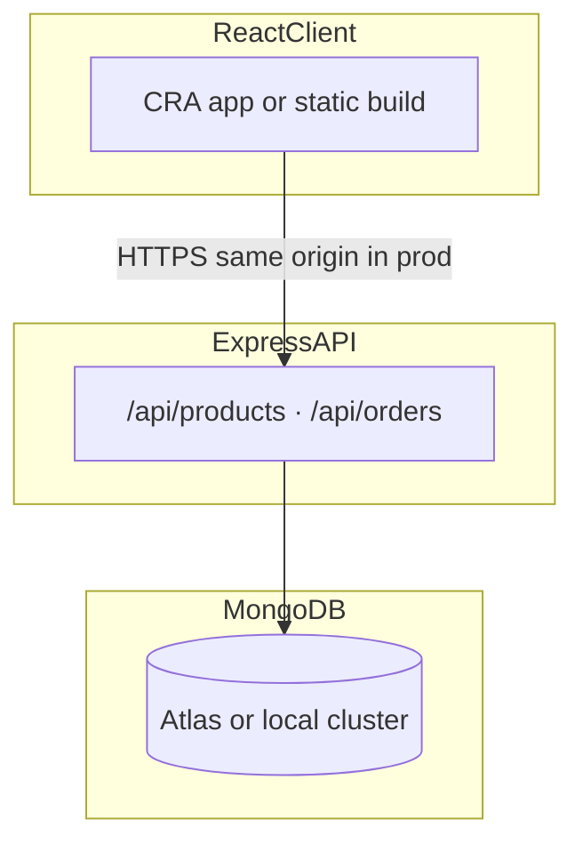

<div align="center">

# Outdoor Adventure Shop

**Full-stack storefront** — React UI, Express REST API, MongoDB persistence.  
Built for clarity, deployable to **Railway** with a single service.

<br />

[](https://nodejs.org/)
[](https://react.dev/)
[](https://expressjs.com/)
[](https://www.mongodb.com/atlas)
[](LICENSE)

<br />

[**Repository**](https://github.com/haimgalata/fullstack-outdoor-store) · **Live demo** — *add your deployed URL after Railway / hosting setup*

</div>

<br />

---

## Preview

<div align="center">

| *Add a homepage screenshot* | *Add cart / checkout screenshots* |
|:---:|:---:|
| `docs/preview-home.png` | `docs/preview-checkout.png` |

</div>

> **Assets:** Product seed data references images such as `/HikingBackpack.jpg`. Place matching files in [`client/public/`](client/public/) or update paths in [`server/server.js`](server/server.js).

<br />

---

## Features

| | |
|:---|:---|
| **Catalog** | Products loaded from MongoDB via `GET /api/products` |
| **Search** | Client-side filter by product name and description |
| **Cart** | Quantities, totals, persistence in `localStorage` |
| **Checkout** | Guest order form; submits to `POST /api/orders` |
| **Seed data** | Default catalog inserted once when the products collection is empty |

<br />

---

## Tech stack

| Layer | Technology |
|:------|:-----------|
| **Frontend** | React 18, Create React App, React Router 6, Bootstrap 5 |
| **Backend** | Node.js, Express, Mongoose |
| **Database** | MongoDB (Atlas or self-hosted) |
| **Auth** | *None* — guest checkout; cart only in the browser |
| **Hosting** | Railway-ready: root `npm run build` → Express serves API + `client/build` |

<br />

---

## Architecture



In **development**, the React dev server proxies `/api/*` to the API on port **5000**. In **production**, one Express process serves the API and the built SPA from the same host.

<br />

---

## Project structure

```text
fullstack-outdoor-store/
├── client/                    # React (CRA)
│   ├── public/              # Static assets & product images (add files to match seed)
│   └── src/
│       ├── App.jsx          # Products, cart state, routing
│       ├── components/      # Navbar, Banner, Cart
│       └── pages/           # Home, Checkout
├── server/
│   ├── .env.example         # Copy → .env (see Environment)
│   ├── server.js            # Express entry, MongoDB, seed, static SPA
│   ├── models/              # Product.js, Order.js
│   └── routes/              # products.js, orders.js
├── package.json             # Root: Railway build + start
├── LICENSE
└── README.md
```

<br />

---

## Environment variables

Create **`server/.env`** from [`server/.env.example`](server/.env.example). On Railway, set the same keys in the service **Variables** UI (never commit secrets).

| Variable | Required | Description |
|:---------|:---------|:------------|
| `MONGO_URI` | Yes* | MongoDB connection string (`mongodb+srv://…` for Atlas). |
| `MONGODB_URI` | No | Alias: used only if `MONGO_URI` is unset. |
| `PORT` | No | API port (default **5000** locally). Set automatically on Railway. |

\*One of `MONGO_URI` or `MONGODB_URI` must be present.

No JWT or third-party API keys are required for this codebase.

<br />

---

## MongoDB Atlas

1. Create a **cluster** in [MongoDB Atlas](https://www.mongodb.com/atlas) (free tier is fine).
2. **Database Access** → add a user (save username and password).
3. **Network Access** → allow your IP for local work, or **`0.0.0.0/0`** for cloud deploys (tighten for production when you can).
4. **Connect** → **Drivers** → copy the SRV string; replace `<password>` and set a database name in the path, e.g. `…/outdoor_shop?retryWrites=true&w=majority`.
5. Paste into **`MONGO_URI`** in `server/.env` (or Railway variables).

<br />

---

## Local development

**Prerequisites:** Node.js **≥ 18**, npm, and a reachable MongoDB URI.

```bash
git clone https://github.com/haimgalata/fullstack-outdoor-store.git
cd fullstack-outdoor-store
```

```bash
cd client && npm install && cd ../server && npm install
```

```bash
# Windows PowerShell
Copy-Item server\.env.example server\.env
# macOS / Linux
# cp server/.env.example server/.env
```

Then edit **`server/.env`** with your **`MONGO_URI`**.

| Terminal | Command | URL |
|:---------|:--------|:----|
| **API** | `cd server` → `npm start` | [http://localhost:5000](http://localhost:5000) |
| **UI** | `cd client` → `npm start` | [http://localhost:3000](http://localhost:3000) |

The client **`proxy`** forwards `/api/*` to port **5000** — no hardcoded API host in the app.

**First run:** If the `products` collection is empty, the server seeds the default catalog once ([`server/server.js`](server/server.js)).

<br />

---

## Production build

From the **repository root** (after `server/.env` is configured):

```bash
npm run build
npm start
```

Open **http://localhost:5000** — Express serves **`client/build`** and **`/api/*`** on one port (same pattern as Railway).

| Scope | Command |
|:------|:--------|
| Client only | `npm run build --prefix client` → output `client/build/` |
| Full pipeline (Railway) | `npm run build` at repo root |

<br />

---

## Railway deployment

| Step | Action |
|:----:|:-------|
| 1 | New Railway project → deploy from GitHub; **root directory** = repo root. |
| 2 | **Build command:** `npm run build` |
| 3 | **Start command:** `npm start` |
| 4 | **Variables:** `MONGO_URI` = your Atlas SRV string (`PORT` is injected by Railway). |

The UI and API share one origin, so relative `/api` calls work without extra CORS configuration.

<br />

---

## Troubleshooting

| Issue | Check |
|:------|:------|
| Server exits with missing MongoDB URI | `server/.env` contains `MONGO_URI` or `MONGODB_URI`. |
| Connection timeout / refused | Atlas network allowlist; correct password (URL-encoded if needed); cluster up. |
| Empty UI / failed fetches in dev | API running on **5000**; browser Network tab for `/api/products`. |
| Broken images | Files in `client/public/` match seed `imageUrl` names, or update seed in `server/server.js`. |
| Port 5000 in use | Set `PORT` in `.env` and align `proxy` in [`client/package.json`](client/package.json). |
| Split hosting CORS | Prefer single-service Railway; otherwise configure CORS + a build-time API base URL. |
| Many `npm audit` issues in `client/` | Run `npm audit fix` **without** `--force`. Residual findings are common with `react-scripts`; clearing them usually means migrating off CRA (e.g. Vite). **`server/`** should report **zero** after `npm audit fix`. |

<br />

---

## Future improvements

- Accounts, sessions, and role-based access  
- Payments (e.g. Stripe) and transactional email  
- Tests, CI, and API rate limiting  
- CDN / object storage for media  

<br />

---

<div align="center">

### License

Released under the [MIT License](LICENSE).

**Haim Galata**

</div>
